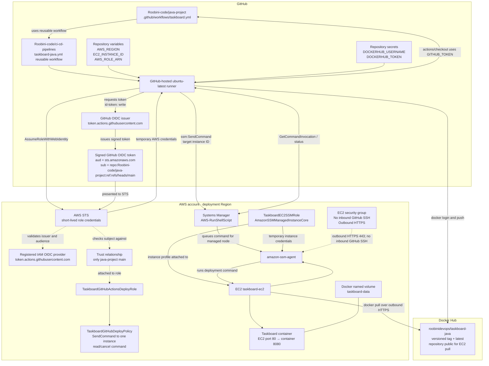

# Taskboard AWS infrastructure and GitHub Actions setup

This guide sets up the infrastructure used by the reusable Taskboard pipeline.
Follow the sections in order:

1. Create and prepare the AWS account and EC2 instance.
2. Configure EC2 Systems Manager (SSM) access.
3. Create the GitHub OIDC provider, deployment policy, and IAM role.
4. Configure Docker Hub and the `java-project` GitHub repository.
5. Run a pull request and then a deployment.

The deployment uses **GitHub OIDC + AWS Systems Manager**. It does not use
AWS access keys in GitHub, an EC2 private SSH key in GitHub, or inbound SSH
from a GitHub-hosted runner.

## 1. What is being connected?

There are two IAM roles. They are separate and must not be confused:

| IAM role | Attached to | Purpose |
| --- | --- | --- |
| `TaskboardEC2SSMRole` | The EC2 instance profile | Lets the SSM agent on EC2 register with Systems Manager and receive commands. Attach AWS-managed policy `AmazonSSMManagedInstanceCore`. |
| `TaskboardGitHubActionsDeployRole` | Assumed temporarily by the GitHub Actions runner through OIDC | Lets the `java-project` `main` workflow send a deployment command to the one configured EC2 instance and read the command result. Attach `TaskboardGitHubDeployPolicy`. |

The GitHub OIDC provider is an IAM account-level identity provider, not an
instance role. It allows AWS STS to validate signed identity tokens issued by
GitHub Actions. The role trust relationship restricts assumption to
`Roobini-code/java-project` on branch `main`.

## 2. Detailed architecture

### 2.1 Resource and trust relationships



The EC2 role is attached to the instance profile and supplies temporary
credentials to the SSM agent. It is **not** assumed by GitHub Actions.

### 2.2 Event and network flow

```mermaid
sequenceDiagram
  autonumber
  actor Dev as Developer
  participant Repo as java-project
  participant Runner as GitHub Actions runner
  participant Docker as Docker Hub
  participant STS as AWS STS / OIDC
  participant SSM as AWS Systems Manager
  participant Agent as EC2 SSM agent
  participant App as Taskboard container

  Dev->>Repo: Open pull request targeting main
  Repo->>Runner: Start reusable workflow
  Runner->>Repo: Checkout with GITHUB_TOKEN
  Runner->>Runner: Set up Java 21; mvn clean verify
  Runner->>Runner: Build Docker image locally
  Runner-->>Dev: PR checks complete; no image publish or deploy

  Dev->>Repo: Merge PR, creating push to main
  Repo->>Runner: Start workflow with contents:write and id-token:write
  Runner->>Repo: Checkout and test app
  Runner->>Docker: Authenticate with Docker Hub token
  Runner->>Docker: Push versioned image and latest
  Runner->>STS: Exchange GitHub OIDC token for role credentials
  STS->>STS: Validate issuer, audience, repo and main-branch subject
  STS-->>Runner: Short-lived AWS role credentials
  Runner->>SSM: SendCommand AWS-RunShellScript to configured instance ID
  Agent->>SSM: Poll/connect outbound over HTTPS 443
  SSM-->>Agent: Return deployment command
  Agent->>Docker: Pull public versioned image over outbound HTTPS
  Agent->>App: Replace container and retain taskboard-data volume
  Agent->>App: Check http://127.0.0.1/
  Agent-->>SSM: Command result and health-check status
  Runner->>SSM: Poll GetCommandInvocation
  SSM-->>Runner: Success or failure output
  alt Health check succeeds
    Runner->>Repo: Create and push versioned Git tag
  else SSM or health check fails
    Runner-->>Dev: Workflow fails; Git tag is not created
  end
```

**Network implication:** GitHub's runner calls public AWS HTTPS APIs (STS and
SSM). The EC2 SSM agent creates outbound HTTPS connections to AWS. SSM carries
the command over those managed connections; EC2 does not accept an inbound
connection from the runner. The runner does not SSH to EC2.

## 3. AWS prerequisites

### 3.1 Account, Region, and cost

1. Use an AWS account you are authorized to administer. Enable MFA and avoid
   using the root user for routine work.
2. Select one AWS Region for the EC2 instance, Systems Manager view, and
   GitHub `AWS_REGION` variable. The IAM OIDC provider is an AWS-account-level
   provider. The setup so far has shown `us-east-2`; confirm the instance's
   actual Region before using that value.
3. Review EC2, EBS, public IPv4, and data-transfer charges. Configure a budget
   alert; an alert is not a spending cap.

### 3.2 EC2 instance requirements

The `taskboard-ec2` instance should use Amazon Linux 2023, be in the same
Region configured for the pipeline, and have:

- A public image repository on Docker Hub, or an explicitly configured
  alternative image-pull authentication mechanism.
- Outbound access to the internet/AWS service endpoints over HTTPS (TCP 443).
- A root EBS volume with enough space for the OS, Docker, and image layers.
  The current Taskboard persistent data is in Docker volume `taskboard-data`
  on the EC2 disk; this workflow does not use EFS.
- An attached instance profile role with `AmazonSSMManagedInstanceCore`
  (created in Step 4).
- Docker Engine and `curl` installed.
- The SSM agent installed, enabled, running, and online as a Systems Manager
  managed node.

The instance needs no inbound rule for GitHub Actions. For your own optional
manual SSH access, retain SSH TCP 22 restricted to your current public IP
(`/32`). For the app, allow HTTP TCP 80 only from intended users. Taskboard
does not provide authentication. Do not open SSH to `0.0.0.0/0`.

### 3.3 Docker Hub requirements

The existing workflow pushes to
`roobinidevops/taskboard-java`. Confirm the repository exists and the account
can push to it. Create a Docker Hub access token with **Read & Write**
permission.

The repository must be **Public** with the current deployment code. The GitHub
runner authenticates to push, but the EC2 deployment command performs
`docker pull` without logging in to Docker Hub. If the repository is private,
modify the deployment command to authenticate on EC2 before relying on it.

## 4. Configure the EC2 Systems Manager role

This is the instance role, not the GitHub deployment role.

1. In the AWS Console, open **IAM → Roles → Create role**.
2. Choose **AWS service** and the **EC2** use case.
3. Attach the AWS-managed policy **`AmazonSSMManagedInstanceCore`**.
4. Name the role `TaskboardEC2SSMRole` and create it.
5. Open **EC2 → Instances**, select `taskboard-ec2`, then choose **Actions →
   Security → Modify IAM role**. Attach `TaskboardEC2SSMRole` and save.
6. Connect to EC2 for setup/verification (SSH limited to your IP is fine) and
   run:

   ```bash
   sudo dnf update -y
   sudo dnf install -y docker curl
   sudo systemctl enable --now docker
   sudo docker --version
   sudo systemctl is-active docker
   sudo systemctl enable --now amazon-ssm-agent
   sudo systemctl is-active amazon-ssm-agent
   ```

   Docker and the SSM agent checks should print a version and `active`.
   Amazon Linux 2023 normally includes the SSM agent. If its service is
   missing, install the Amazon Linux package with
   `sudo dnf install -y amazon-ssm-agent`, then enable and start it.
7. In **Systems Manager → Fleet Manager** or **Managed nodes**, select the
   same Region and wait for this EC2 instance to appear **Online**.

If it remains offline, verify that the EC2 instance profile is attached, the
agent is active, the instance has DNS resolution and outbound TCP 443, and
the VPC route/NAT path can reach regional Systems Manager endpoints. A
security-group outbound rule allowing all traffic (the current setup) already
permits HTTPS; do not add an inbound 443 rule. With restrictive network ACLs,
allow outbound HTTPS and the corresponding return traffic.

## 5. Create the GitHub OIDC provider in IAM

Create this once per AWS account:

1. Open **IAM → Identity providers → Add provider**.
2. Provider type: **OpenID Connect**.
3. Provider URL: `https://token.actions.githubusercontent.com`.
4. Audience: `sts.amazonaws.com`.
5. Add the provider. If it already exists, reuse it; do not create a duplicate.

This provider establishes GitHub as an OIDC token issuer. It does not itself
grant permissions; the role trust relationship and attached permissions policy
control access.

## 6. Create the GitHub deployment permissions policy

This is the **permissions policy**, which controls what a successfully
authenticated GitHub role can do. It is not the role trust policy.

1. In the AWS Console, open **IAM → Policies → Create policy → JSON**.
2. Replace `<REGION>`, `<ACCOUNT_ID>`, and `<INSTANCE_ID>` in the JSON below
   with the EC2 Region, 12-digit AWS account ID, and exact EC2 instance ID.
3. Create the policy named `TaskboardGitHubDeployPolicy`.

```json
{
  "Version": "2012-10-17",
  "Statement": [
    {
      "Sid": "SendDeploymentOnlyToTaskboardInstance",
      "Effect": "Allow",
      "Action": "ssm:SendCommand",
      "Resource": [
        "arn:aws:ssm:<REGION>::document/AWS-RunShellScript",
        "arn:aws:ec2:<REGION>:<ACCOUNT_ID>:instance/<INSTANCE_ID>"
      ]
    },
    {
      "Sid": "ReadAndCancelDeploymentCommand",
      "Effect": "Allow",
      "Action": [
        "ssm:GetCommandInvocation",
        "ssm:CancelCommand"
      ],
      "Resource": "*"
    }
  ]
}
```

Example account, Region, and instance details previously shown in the AWS
screenshots were `142643434331`, `us-east-2`, and
`i-09f9a21c034a3947a`. Treat these only as examples: verify all three against
the current AWS console before creating the policy. If the EC2 instance is
replaced, update the policy resource and the GitHub `EC2_INSTANCE_ID` variable.

## 7. Create the GitHub Actions IAM role

This is the separate role assumed by GitHub Actions. The GitHub owner/org field
in the IAM wizard is `Roobini-code`, the repository is `java-project`, and the
branch is `main`.

1. Open **IAM → Roles → Create role → Web identity**.
2. Select the provider `token.actions.githubusercontent.com` and audience
   `sts.amazonaws.com`.
3. If the wizard asks for **GitHub organization**, enter `Roobini-code`. Enter
   repository `java-project` and branch `main` if those fields are offered.
   Do not leave the repository/branch as wildcard `*`.
4. Attach the existing `TaskboardGitHubDeployPolicy`. Do not paste the trust
   policy into the permissions-policy editor.
5. Name the role `TaskboardGitHubActionsDeployRole` and create it.
6. Open the role's **Trust relationships** and ensure it restricts assumption
   to this repository's `main` branch. The trust relationship should be:

   ```json
   {
     "Version": "2012-10-17",
     "Statement": [
       {
         "Effect": "Allow",
         "Principal": {
           "Federated": "arn:aws:iam::<ACCOUNT_ID>:oidc-provider/token.actions.githubusercontent.com"
         },
         "Action": "sts:AssumeRoleWithWebIdentity",
         "Condition": {
           "StringEquals": {
             "token.actions.githubusercontent.com:aud": "sts.amazonaws.com",
             "token.actions.githubusercontent.com:sub": "repo:Roobini-code/java-project:ref:refs/heads/main"
           }
         }
       }
     ]
   }
   ```

   Replace `<ACCOUNT_ID>` with your AWS account ID. If the wizard generated a
   broader trust policy, edit the role's trust relationship to match the
   restricted policy above.
7. In the role summary, copy the ARN. It has the form
   `arn:aws:iam::<ACCOUNT_ID>:role/TaskboardGitHubActionsDeployRole`; this
   becomes the GitHub repository variable `AWS_ROLE_ARN`.

The workflow requests `id-token: write` only to obtain a short-lived OIDC
token. It does not create or store AWS access keys. The AWS credentials
returned by STS are temporary and scoped by `TaskboardGitHubDeployPolicy`.

## 8. Configure GitHub Actions

### 8.1 Allow the reusable workflow

In `Roobini-code/ci-cd-pipelines`, ensure
`.github/workflows/taskboard-java.yml` is on the referenced branch (`main` in
the current app workflow).

In `Roobini-code/java-project`, ensure Actions are enabled and the repository
is allowed to call the reusable workflow. If `ci-cd-pipelines` is private,
configure its **Settings → Actions → General → Access** to allow `java-project`
to use its workflows.

For production, change the app workflow's `uses:` reference from `@main` to a
reviewed immutable commit SHA or release tag.

### 8.2 Add repository variables

In `java-project`, open **Settings → Secrets and variables → Actions →
Variables → New repository variable**. Add:

| Variable | Value |
| --- | --- |
| `AWS_REGION` | The exact Region containing EC2, for example `us-east-2`. |
| `EC2_INSTANCE_ID` | The exact EC2 instance ID, for example `i-09f9a21c034a3947a` after verifying it. |
| `AWS_ROLE_ARN` | Full role ARN copied in Step 7. |

These are configuration values, not secret credentials. Add them to the
**application repository** `java-project`, not to `ci-cd-pipelines`.

### 8.3 Add Docker Hub repository secrets

In `java-project`, open **Settings → Secrets and variables → Actions →
Secrets → New repository secret**. Add:

| Secret | Value |
| --- | --- |
| `DOCKERHUB_USERNAME` | Docker Hub username with push permission. |
| `DOCKERHUB_TOKEN` | Docker Hub access token with Read & Write permission. |

Do not add a GitHub PAT, AWS access key, EC2 private SSH key, EC2 hostname, or
host-key entry as a workflow secret for this SSM design. If old
`EC2_HOST`, `EC2_SSH_PRIVATE_KEY`, or `EC2_KNOWN_HOSTS` secrets exist from the
previous SSH design, they are unused and can be removed.

### 8.4 Set workflow permissions and branch protection

1. In `java-project`, open **Settings → Actions → General** and permit the
   workflow to write repository contents. The reusable workflow uses this to
   create and push the deployment Git tag.
2. The app caller requests `contents: write` for tagging and `id-token: write`
   for OIDC. Keep these permissions scoped to the workflow/job; do not grant
   broad organization-wide permissions.
3. Protect `main` and require pull requests/reviews. Every push to `main`
   publishes and deploys.

## 9. Pipeline execution details

### Pull request targeting `main`

The reusable workflow checks out the app using GitHub's automatic
`GITHUB_TOKEN`, installs Java 21, runs `mvn -B clean verify`, and builds a
local Docker image. It does not log in to Docker Hub, request AWS credentials,
send an SSM command, or deploy.

### Push/merge to `main`

After verification succeeds, the workflow:

1. Derives an image tag from the Maven project version and Actions run
   number/attempt, for example `1.0.0-42.1`.
2. Logs in to Docker Hub with the two repository secrets.
3. Builds and pushes both `roobinidevops/taskboard-java:<versioned-tag>` and
   `roobinidevops/taskboard-java:latest`.
4. Requests an OIDC token and assumes `TaskboardGitHubActionsDeployRole`.
5. Sends an `AWS-RunShellScript` command with `ssm:SendCommand` to the
   configured instance ID.
6. EC2's online SSM agent receives and runs the command. It pulls the
   versioned public image, replaces the container, and reuses the Docker
   volume `taskboard-data`.
7. The command polls the local app HTTP endpoint. If the new container fails
   to start or pass health checking, it attempts to restore the previous
   container and reports failure.
8. The GitHub runner reads the SSM command result. Only on success does it
   create and push the corresponding Git tag, for example `v1.0.0-42.1`.

The EC2 host has no Docker Hub login in this design, so its image repository
must remain public. The EC2 deployment command and instance must be in the
same AWS Region configured in `AWS_REGION`.

## 10. First-run checklist

- [ ] EC2 is running in the intended Region and has Docker installed.
- [ ] `TaskboardEC2SSMRole` with `AmazonSSMManagedInstanceCore` is attached to
  the instance.
- [ ] The SSM agent is active and the instance is Online in Systems Manager.
- [ ] EC2 outbound HTTPS works; no GitHub inbound SSH rule was added.
- [ ] Docker Hub repository exists, is Public, and the token can push.
- [ ] IAM OIDC provider exists with audience `sts.amazonaws.com`.
- [ ] `TaskboardGitHubDeployPolicy` uses the correct Region/account/instance.
- [ ] The GitHub role trust restricts subject to
  `repo:Roobini-code/java-project:ref:refs/heads/main`.
- [ ] The GitHub role has `TaskboardGitHubDeployPolicy` attached.
- [ ] The three GitHub repository variables and two Docker Hub secrets are
  configured in `java-project`.
- [ ] Cross-repository reusable-workflow access is enabled.
- [ ] `main` is protected and Actions can create tags.

Run a pull request first and confirm tests and the Docker build pass. Once
merged, inspect the Actions job logs, Systems Manager command result, Docker
Hub tags, running EC2 container, app endpoint, and new Git tag.

## Troubleshooting

| Symptom | Checks |
| --- | --- |
| EC2 is missing from Systems Manager | Confirm the instance profile role and `AmazonSSMManagedInstanceCore`, active SSM agent, same Region in the console, DNS, route, and outbound HTTPS 443. |
| OIDC `AssumeRoleWithWebIdentity` is denied | Confirm provider URL/audience, role ARN, caller `id-token: write`, and exact `sub` repository/branch in the role trust relationship. |
| GitHub gets `ssm:SendCommand` access denied | Confirm the permissions policy contains the AWS-RunShellScript document ARN and exact EC2 instance ARN for the configured Region/account. |
| SSM accepts command but execution fails | Inspect invocation stdout/stderr in the Actions logs; verify Docker is active, the Docker Hub image is public, outbound HTTPS works, and port 80 is available. |
| Docker push fails | Verify the Docker Hub username and Read & Write token are repository secrets in `java-project`, and that the account can push to the named repository. |
| Tag push fails | Verify Actions `contents: write` and confirm repository rules permit the GitHub Actions bot to create tags. |
